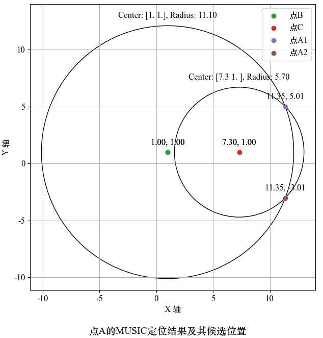
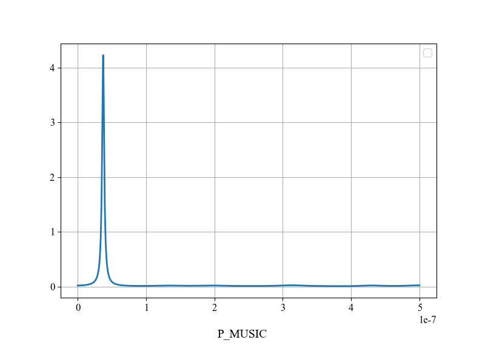
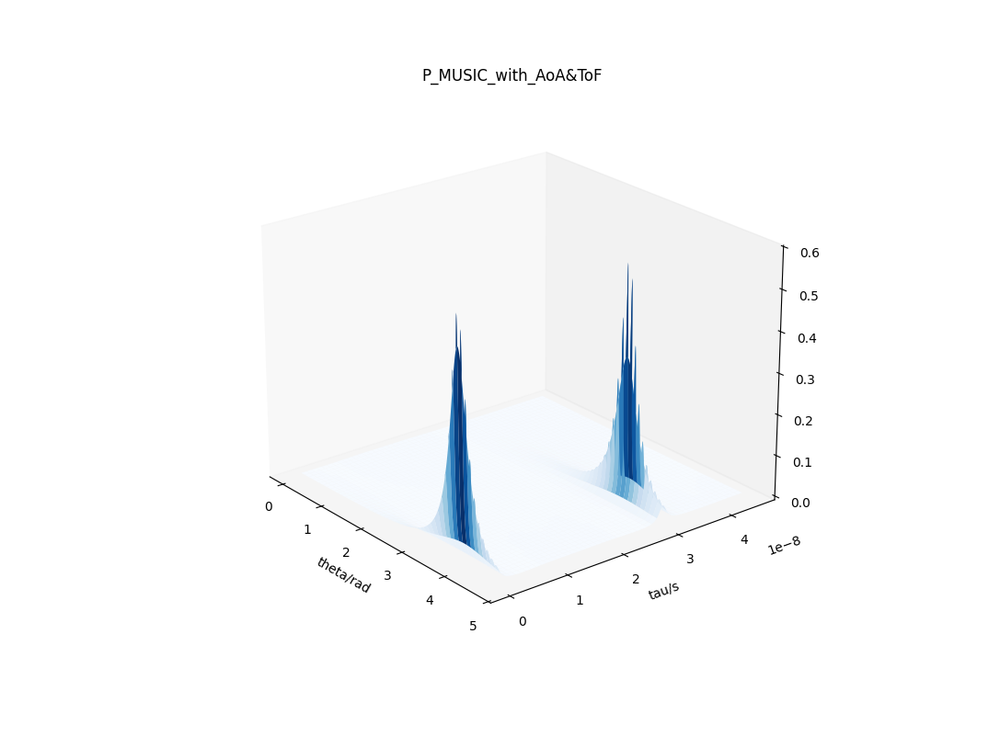
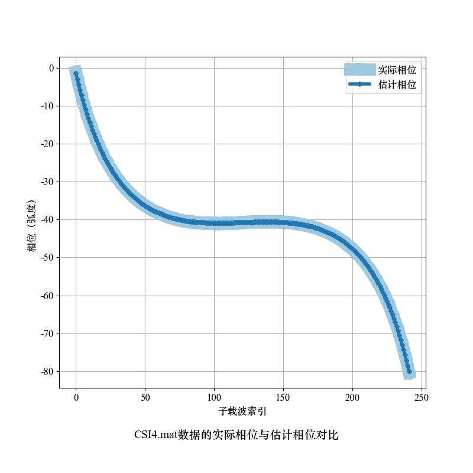

# 基于 ToF 估算的室内定位问题研究

# 一些结果展示
点A的MUSIC定位结果及其候选位置

MUSIC算法的估计ToF结果

MUSIC算法的估计AoA和ToF结果

CSI4.mat数据的实际相位与估计相位对比

# 文件结构
| 文件名           | 功能描述                                          |
|------------------|--------------------------------------------------|
| CSIdata.py       | 处理 CSI 矩阵的库，包含平滑、MUSIC 算法等操作     |
| AccurateCSI.py   | 处理 CSI 相位误差的库，包含解缠、拟合等操作       |
| visual.py        | 对 matplotlib 常见操作的抽象                      |
| q1.py            | 问题一程序代码                                    |
| q2.py            | 问题二程序代码                                    |
| q2_2.py          | 问题二拓展程序代码                                |
| q3.py            | 问题三程序代码                                    |
| z500.npy         | q2_2 中 500*500 矩阵计算数据，其他以此类推                     |
| ./data           | 题目的 CSI 数据文件                               |

# 备注
data 文件夹中的数据文件是出题组官方提供的，版权归其所有，不可用于其他用途。